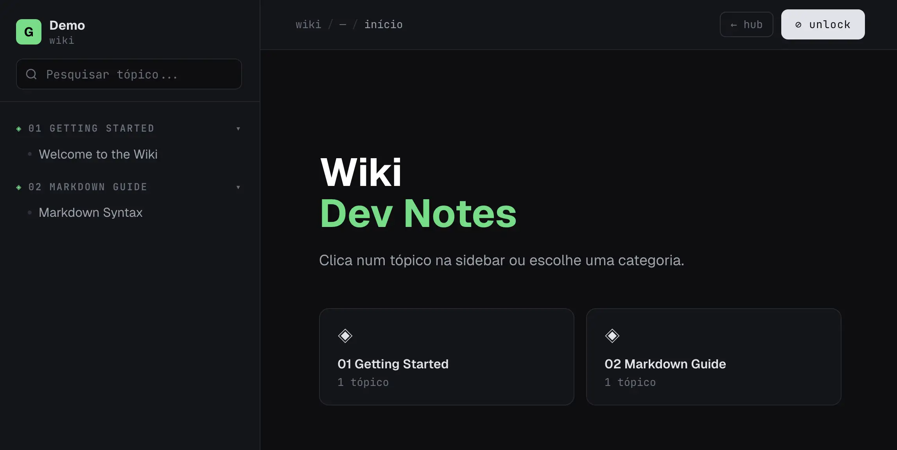
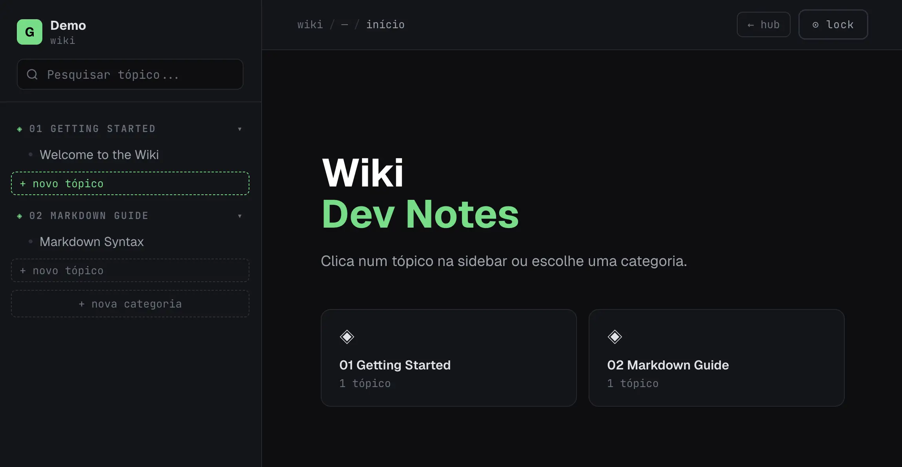
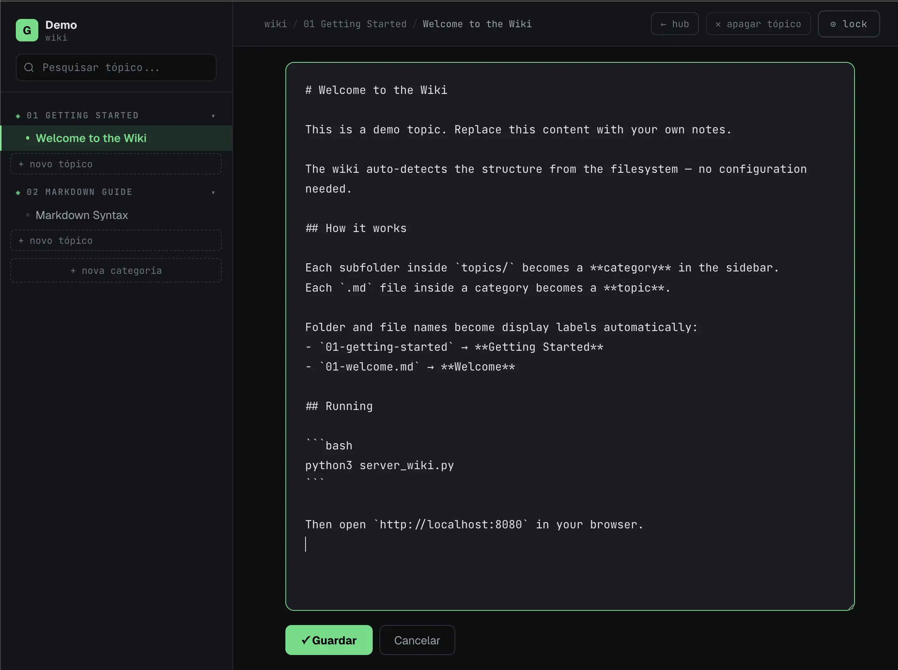

# Wiki

A lightweight personal wiki. 

Self hosted, single-file frontend, Python server, no dependencies.







## Stack

- `index.html` — all CSS and JS inline, no build step, no npm
- `server_wiki.py` — Python stdlib HTTP server with a small REST API
- Custom regex Markdown parser (no external library)

## Running

```bash
python3 server_wiki.py
# open http://localhost:8080
```

## Content structure

```
<wiki-root>/
└── <sub-wiki>/
    └── topics/
        └── <category-slug>/
            └── <topic-slug>.md
```

The server auto-detects two modes:

- **Standalone** — a single `topics/` folder at root → goes straight to the wiki
- **Hub** — multiple sub-wikis at root → shows a card grid to pick one

Category and topic names are derived from folder/file slugs (hyphens → spaces, words capitalised). No config files needed.

## Editing

Click the lock icon to unlock edit mode. Clicking any topic opens an inline editor. Save writes directly back to the `.md` file.

## API

| Method | Path | Description |
|--------|------|-------------|
| `GET` | `/api/topics[?wiki=]` | Category/topic tree |
| `GET` | `/api/topic?cat=&slug=[&wiki=]` | Raw markdown |
| `PUT` | `/api/topic?cat=&slug=[&wiki=]` | Save markdown |
| `POST` | `/api/topic` | Create topic |
| `POST` | `/api/category` | Create category |
| `DELETE` | `/api/topic?cat=&slug=[&wiki=]` | Delete topic |
